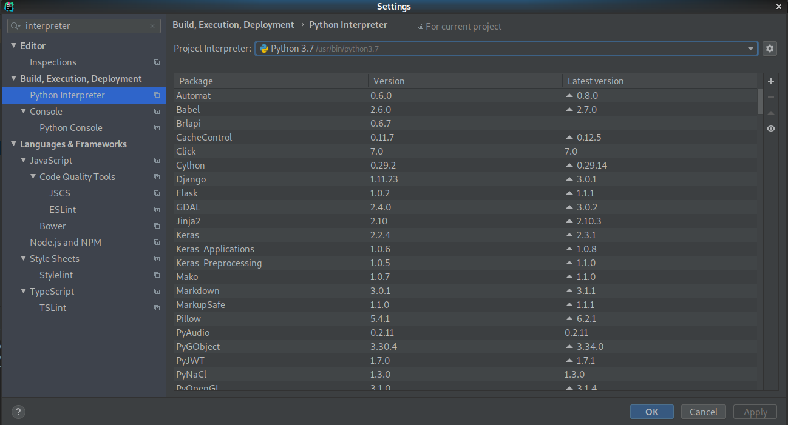
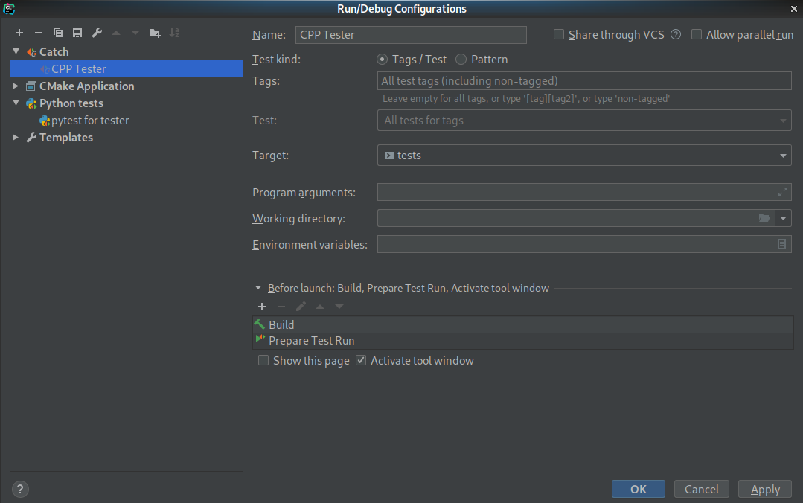
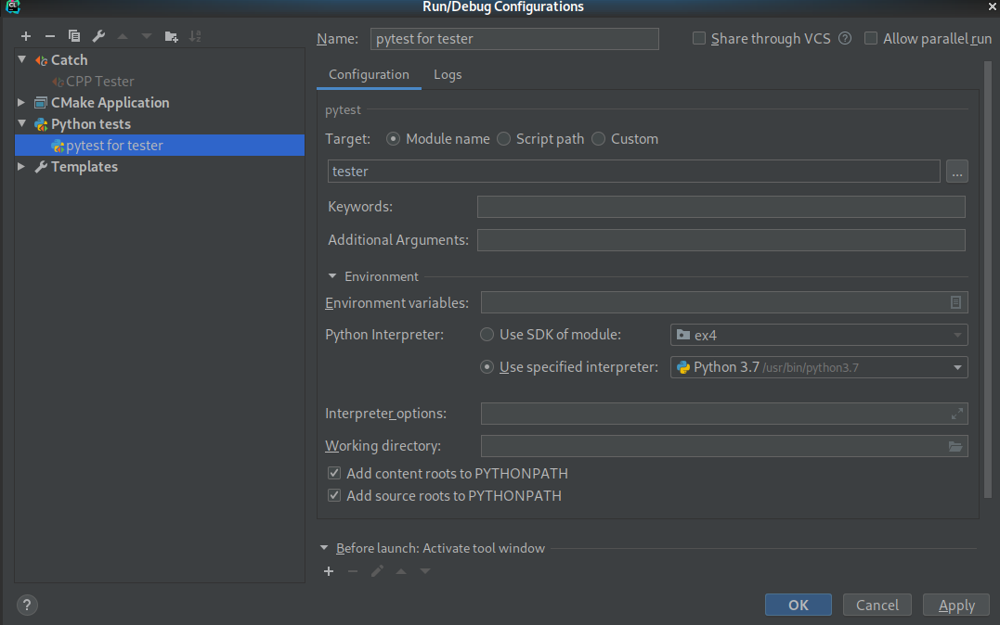

# Tester for cpp_ex1

There are two testers here: a C++ tester(via the Catch2 library) that links your code(treating it as a library) and calling methods directly,
and a Python tester that runs your compiled executable on the school's provided image files, and compares your results with
the school's solution

## What isn't being tested

- I probably missed some error cases
- Matrix::plainPrint
- Memory leaks while running the entire program(Python tester doesn't use valgrind)

## What is being tested

- Matrix class
- Activation class
- Output of your MlpNetwork using the School's weights/biases and images
- Memory leaks in Matrix/Activation, while running the C++ tester with valgrind

## Assumptions/Requirements
I assume you're working on an Aquarium PC, if you cannot access one physically, [Here's a tutorial](http://wiki.cs.huji.ac.il/wiki/Connecting_from_outside#Using_MobaXterm_for_X11_on_Windows) on 
remotely connecting to the Aquarium via Windows(with a graphical interface so you can use CLion)

Theoretically the tests may work under other platforms equipped with a C++17 build environment, Python3.7 or higher with the `pytest` library,
but these aren't supported. In case of any issues, use an Aquarium PC.

## Possible Errors - PLEASE READ THIS!!!!!!!!!!!

Linking/compilation errors can be caused by one of the following reasons:

- Improper configuration due to not following the instructions or not using a supported environment. 

- Errors due to wrong class member/function definitions. These can actually be thought as part of the tests - ensuring your
  class implementation is logical and use proper signatures
   
  By looking at the error messages or the usage in the test, you should figure out the needed signatures. 
  
- Test failures thrown by Catch2 - on lines such as CHECK_THAT or REQUIRE_REQUIRE (The only difference between them is
  that REQUIRE immediately stops the test, while CHECK lets the errors accumulate)
  
  **You should be able to read the tests source code and understand the reason for errors.**
  
- Other runtime errors or crashes(e.g segmentation fault) may occur while running the tests, in those cases, run the tester
  with a debugger to find out what happened.

## Instructions
All of the files under this repository should be placed in a `tests` folder under your main project's folder,
you can easily do so by running the following commands in the terminal:

```shell script
cd MY_PROJECT_FOLDER
git clone https://github.cs.huji.ac.il/danielkerbel/MY_PROJECT_FOLDER tests
```

Afterwards, your project root directory should look more or less like this:

```
MY_PROJECT_FOLDER/                             <- created by you, includes your own implementation
MY_PROJECT_FOLDER/main.cpp                      
MY_PROJECT_FOLDER/other cpp and h files...
MY_PROJECT_FOLDER/CMakeLists.txt               <- you will need to modify this, see below
MY_PROJECT_FOLDER/tests                        <- cloned via git, includes the tester
MY_PROJECT_FOLDER/tests/CMakeLists.txt         <- no need to touch this
```

You need to modify your own CMakeLists.txt (**the one that was made by CLion, not the one included with the repo**) and add
the following line at the bottom:
```cmake
add_subdirectory(tests)
```


## Configuration

You can use CLion to run both the C++ tester and the Python tester.
First, you'll need to add a `Python 3.7` (or higher) interpreter to the project, by going to `File | Settings | Build, Execution, Deployment | Python Interpreter`
and ensuring it looks like this: 
(Alternatively, if using PyCharm, this step shouldn't be necessary)

Then, you'll need to add run configurations for the C++ tester, by going to `Run | Edit Configurations...` and adding a `Catch`
configuration, so it should look like this: 

Finally, add a `Python tests > pytest` configuration, so it should look like this: 

## Running
Click `Run... | CPP Tester` or `Run... | pytest for tester` to run the C++ tester or Python tester, respectively.
Note that you can also run the CPP Tester with CLion's debugger or with Valgrind.
